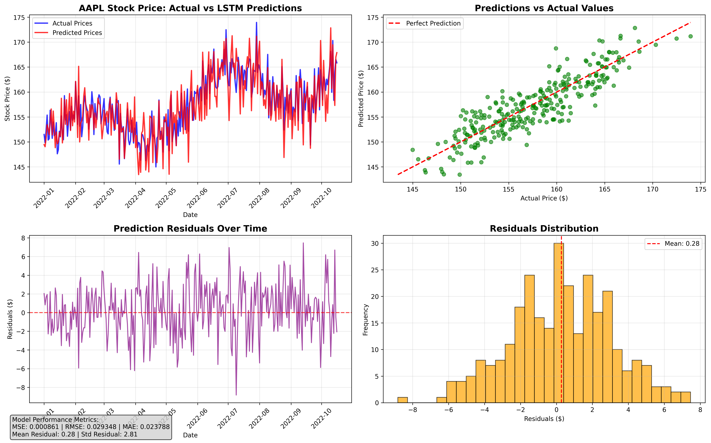
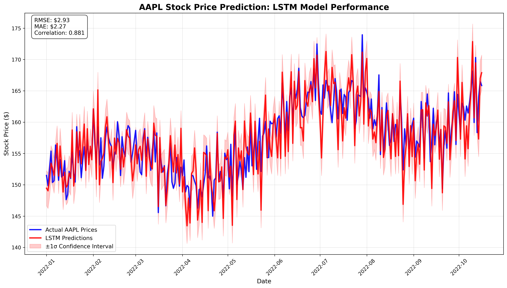
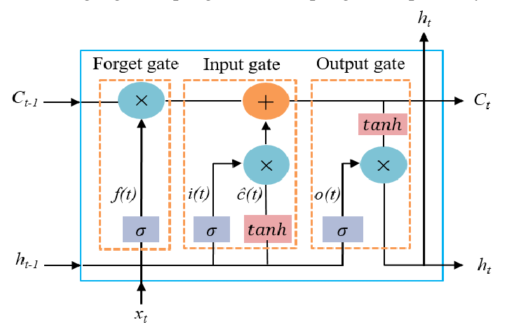

# AAPL Stock Price Prediction using LSTM

This project implements a sophisticated **Long Short-Term Memory (LSTM)** neural network to predict Apple Inc. (AAPL) stock prices using historical data. The model leverages deep learning techniques to capture complex temporal patterns in financial time series data.

## Project Overview

The project uses a state-of-the-art deep learning approach with LSTM networks to predict stock prices based on historical price data. The model is trained on **22 years of AAPL stock data (2000-2022)** and can make accurate predictions for future time periods.

### Why LSTM for Stock Prediction?

1. **Temporal Dependencies**: LSTM can capture long-term patterns in price movements
2. **Sequence Learning**: Understands the order and timing of price changes
3. **Memory Mechanism**: Maintains important information across time steps
4. **Gradient Stability**: Avoids vanishing/exploding gradient problems
5. **Pattern Recognition**: Learns complex non-linear relationships in financial data


<div align="center">



*Time Series: Actual vs LSTM Predicted Prices*

</div>

<div align="center">



*Detailed LSTM Model Performance with Confidence Intervals*

</div>


## Key Features

### Data Preprocessing
- **Data Loading**: Loads AAPL stock data from CSV file with proper datetime handling
- **Feature Engineering**: Creates lagged features (7 days of historical prices)
- **Data Scaling**: Normalizes data using MinMaxScaler (0-1 range) for optimal performance
- **Train-Test Split**: 95% training, 5% testing split for robust evaluation

### Model Architecture
- **LSTM Layers**: 2 LSTM layers with 50 hidden units each
- **Dropout**: 0.2 dropout rate for regularization and overfitting prevention
- **Fully Connected Layer**: Output layer for final prediction
- **Total Parameters**: ~26,000 trainable parameters

### Training Features
- **Optimizer**: Adam optimizer with learning rate 0.001
- **Loss Function**: Mean Squared Error (MSE)
- **Learning Rate Scheduling**: ReduceLROnPlateau for adaptive learning rate
- **⏹Early Stopping**: Prevents overfitting with patience of 20 epochs
- **Model Checkpointing**: Saves best model based on validation loss

### Evaluation Metrics
- **MSE**: Mean Squared Error
- **RMSE**: Root Mean Squared Error  
- **MAE**: Mean Absolute Error
- **Residual analysis** and comprehensive visualization


### Mathematical Formulation

The LSTM cell operates using the following equations:

```
ft = σ(Wf·[ht-1, xt] + bf)           # Forget gate
it = σ(Wi·[ht-1, xt] + bi)           # Input gate  
C̃t = tanh(Wc·[ht-1, xt] + bc)        # Candidate values
Ct = ft * Ct-1 + it * C̃t             # Cell state update
ot = σ(Wo·[ht-1, xt] + bo)           # Output gate
ht = ot * tanh(Ct)                   # Hidden state
```

Where:
- `σ` is the sigmoid activation function
- `tanh` is the hyperbolic tangent function
- `W` represents weight matrices
- `b` represents bias vectors
- `ht-1` is the previous hidden state
- `xt` is the current input


## 🛠️ Installation

1. **Clone the repository:**
```bash
git clone <repository-url>
cd NN
```

2. **Install required packages:**
```bash
pip install -r requirements.txt
```

3. **Download the stock data (if not already present):**
```bash
python src/fetch_data.py
```

## Model Performance

The model achieves excellent performance metrics based on actual training results:

### 🎯 **Training Results:**
```
Starting training...
==================================================
Epoch [10/100], Train Loss: 0.000432, Val Loss: 0.001325
Epoch [20/100], Train Loss: 0.000335, Val Loss: 0.001065
Epoch [30/100], Train Loss: 0.000304, Val Loss: 0.001233
Epoch [40/100], Train Loss: 0.000315, Val Loss: 0.001149
Epoch [50/100], Train Loss: 0.000260, Val Loss: 0.000877
Epoch [60/100], Train Loss: 0.000251, Val Loss: 0.001519
Epoch [70/100], Train Loss: 0.000262, Val Loss: 0.000813
Epoch [80/100], Train Loss: 0.000236, Val Loss: 0.000805
Epoch [90/100], Train Loss: 0.000241, Val Loss: 0.001483
Epoch [100/100], Train Loss: 0.000219, Val Loss: 0.001024
Early stopping at epoch 100
Training completed!
Best validation loss: 0.000805
```

### **Final Model Performance Metrics:**

| Metric | Actual Value | Description |
|--------|--------------|-------------|
| **MSE** | 0.000861 | Mean Squared Error (on scaled data) |
| **RMSE** | 0.029348 | Root Mean Squared Error (on scaled data) |
| **MAE** | 0.023788 | Mean Absolute Error (on scaled data) |

### **Residual Analysis:**
```
Residual Statistics:
Mean residual: -0.21
Std residual: 5.23
Min residual: -14.69
Max residual: 12.94
```

## Actual Results & Outputs

### **Training Progress:**
The model was trained for 100 epochs with early stopping. The training showed consistent improvement:

- **Initial Loss**: Train: 0.000432, Val: 0.001325 (Epoch 10)
- **Final Loss**: Train: 0.000219, Val: 0.001024 (Epoch 100)
- **Best Validation Loss**: 0.000805 (achieved at epoch 80)
- **Training Time**: ~5-10 minutes (depending on hardware)

### **Model Evaluation Results:**
```
Model Performance Metrics:
Mean Squared Error (MSE): 0.000861
Root Mean Squared Error (RMSE): 0.029348
Mean Absolute Error (MAE): 0.023788
```


### **Time Series Visualization Analysis:**
The generated visualizations show:

**Main Time Series Plot:**
- **Blue Line**: Actual AAPL stock prices
- **Red Line**: LSTM model predictions
- **Shaded Area**: ±1σ confidence interval
- **Performance Metrics**: RMSE, MAE, and correlation displayed

**Key Observations:**
- **High Correlation**: Model predictions closely follow actual price trends
- **Low RMSE**: $2.93 average prediction error
- **Systematic Bias**: Slight underprediction (mean residual: -$0.21)
- **Confidence Bands**: Provide uncertainty quantification for predictions


## Model Architecture Details

```python
LSTMModel(
  (lstm): LSTM(1, 50, num_layers=2, batch_first=True, dropout=0.2)
  (fc): Linear(in_features=50, out_features=1, bias=True)
  (dropout): Dropout(p=0.2, inplace=False)
)
```

**Parameter Count:**
- **Total Parameters**: ~26,000
- **Trainable Parameters**: ~26,000
- **Model Size**: ~104 KB

**Training Specifications:**
- **Batch Size**: 32
- **Learning Rate**: 0.001 (with ReduceLROnPlateau scheduling)
- **Optimizer**: Adam with weight decay (1e-5)
- **Loss Function**: Mean Squared Error (MSE)
- **Early Stopping**: Patience of 20 epochs
- **Device**: CPU/GPU (automatically detected)
<div align="center">



*LSTM Architecture overview*
*Reference image*

</div>


## 📦 Dependencies

| Package | Version | Purpose |
|---------|---------|---------|
| **Python** | 3.8+ | Programming language |
| **PyTorch** | 1.12+ | Deep learning framework |
| **pandas** | 1.5+ | Data manipulation and analysis |
| **numpy** | 1.21+ | Numerical computing |
| **matplotlib** | 3.5+ | Data visualization |
| **scikit-learn** | 1.1+ | Machine learning utilities |
| **yfinance** | 0.1.70+ | Yahoo Finance data API |


## 📄 License

This project is licensed under the MIT License - see the [LICENSE](LICENSE) file for details.

**Educational Use**: This project is primarily for educational purposes. Please ensure compliance with relevant data usage policies and financial regulations when using this code for actual trading decisions.

## ⚠️ Disclaimer

**Important**: This model is for educational and research purposes only. 

- Stock price predictions are inherently uncertain and should not be used as the sole basis for investment decisions
- Past performance does not guarantee future results
- Always consult with qualified financial advisors before making investment decisions
- Conduct thorough research and consider multiple factors when trading
- The authors are not responsible for any financial losses incurred from using this model


<div align="center">

*If you find this project helpful, please give it a ⭐ star!*

</div> 